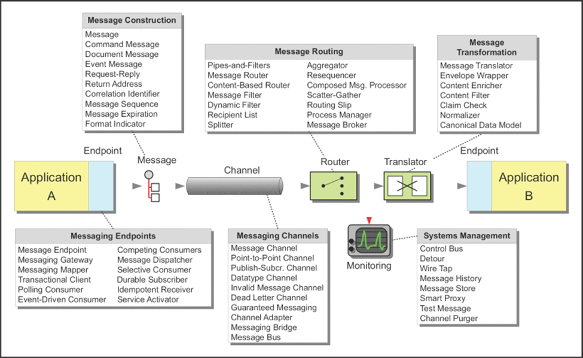
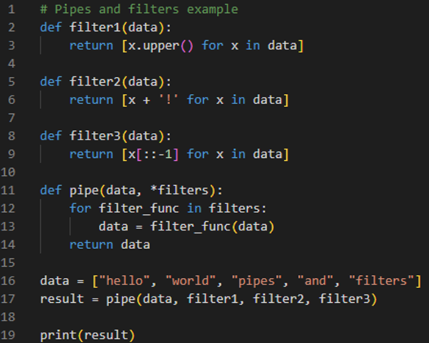
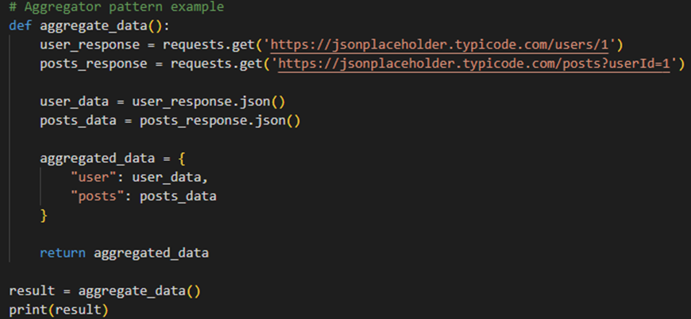
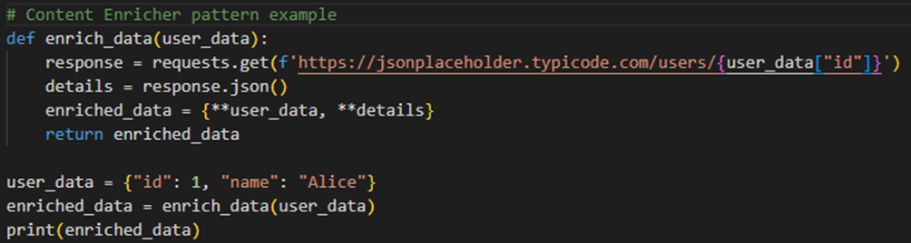

# OLA 1 Systems Integration

## Enterprise Integration Patterns and Technology

### Technology and Development Stack

| Layer                  | Tools          |
|------------------------|----------------|
| Version Control        | Git, GitHub    |
| IDE                    | Intellij       |
| Desk (Online Research) | Stack Overflow |
| Front-end              | JavaScript     |
| Back-end               | Spring         |
| Database               | MySQL          |
| Deployment             | Docker         |
| CI/CD and Testing      | GitHub Actions |
| Collaboration          | Trello         |

### What is Enterprise Integration?
Enterprise Integration is a framework for connecting systems, applications and data sources together so it can work as one system. This enables companies and organizations to exchange and process data across different departments and therefore improving the performance of the company or organization. Theres a few different key components for Enterprise Integration.

#### Application Integration
Connecting software applications so that can work together and exchange data. This can increase operational efficiency when software applications designed for their own specific purpose can work together. One example of an industry that might use this is manufacturing. Factories can have hundreds of different devices in a production line, and they connect their devices that track inventory or control manufacturing environments to find problems, improve quality and lower cost.

#### Data Integration
Data integration is about combining data from different sources to unified view that can help create a better and easier overview so that the business or organization can create better and faster decisions. Data integration can do simple tasks such as querying inventory to complex predictive analytics. 

#### Cloud Integration
Kinda like data integration it brings data from different sources together but the advantage is that now it’s in the cloud so you can access the data from different devices anywhere, anytime. This is especially useful for companies and organizations that have offices and departments in a lot of different countries. 

#### API integration
API’s enables different software to communicate through different rules and protocols. You can integrate third party APIs into an application to improve it without having to create the API from scratch and instead have programmers working on other parts of the application. This allows an exchange of data across companies and organizations. One of the differences between data integration and API is that the API data is usually sold to other companies and organizations.

#### Platform Integration
IT specialists use a variety of software tools to develop secure integration processes that connect and manage different cloud-based systems, applications, software development services, and data sources. Platform integration Integrated Platform as a Service (iPaaS) and platform integration are related concepts that play a key role in this process.

#### Process Integration
Process integration is about optimizing the workflow and process when developers work on multiple different applications and systems.

#### Device integration
Devices are connected so that they can communicate and interact across different areas that the business needs.

#### Monolithic
Monolithic applications are built as single centralized units which makes them easier to manage. They are often more straightforward to develop and deploy especially for smaller teams. This makes for faster development because the code base is quite simple. It also makes testing faster and easy to debug since all the code is found in one place.
The problem becomes when they grow too large. A small change to a single can mean having to compile and test the entire platform. A single bug might affect the entire application and there’s also issues with being able to scale individual components. When you make a change, it will also require you to redeploy the entire monolith.

#### Microservices
Microservices relies on independently deployable services. These services serve the own functions and have their own databases and logic. When you run into bugs you only need to update, test and deploy the service where the bug has occurred. Using microservices is related with DevOps and is important for the continuous delivery practice. Microservices solve a lot of problems for companies with large code bases. It also promotes using agile through CI/CD (continuous integration and continuous delivery). Making change to the software is faster and easier and can therefore push out updates and new features much more often. A service can also be swapped out much easier if new faster and cheaper technologies are released. 
Microservices can have higher costs since each microservice needs its own test suite and deployment. The system becomes more complex and each individual working on the project might not have a not of knowledge of how every part of the microservices work. This will require more communication and collaboration between the teams that are working on the different parts. It may also require a different knowledge set for developers who are used to building monolithic applications.

### Enterprise Integration Patterns
Enterprise Integration Patterns (EIP) are practices on how best to integrate systems, data and applications. Theres a total of 65 different patterns in 9 different categories as described in the book Enterprise Integration Patterns by Gregor Hohpe and Bobby Woolf. It helps with integrations between enterprise applications and the problems that can occur when integrating diverse systems, applications, and services across a company or organization. It focuses on message routing, message transformation, and message management. Some examples of message brokers include RabbitMQ, Apache Kafka, and ActiveMQ. When it comes to microservices EIP are used to integrate services using Kafka or API gateways. 
Here are some examples of integration patterns: 

1.	Message Router
Scenario: Multiple systems receive messages from a central system. Each message must be routed based on its content. 
Pattern: A Content-Based Router examines the message's content and routes it to the appropriate system.
System A sends messages about new customer orders. 
The router checks the message type:
If the message is for domestic shipping, it routes to System B.
If it's for international shipping, it routes to System C.

2.	Request-Reply
Scenario: An application needs to request data from another system and wait for a response.
Pattern: The Request-Reply pattern sends a synchronous request and waits for a synchronous response.
System A sends a customer ID to System B and requests the customer’s profile.
System B looks up the profile and responds to System A with the data

3.	Event-Driven 
Scenario: Systems need to react to events generated by other systems, but they don’t need to know about each other directly.
Pattern: The Publish-Subscribe pattern decouples publishers and subscribers. A publisher sends events, and multiple subscribers receive and process the events.
An e-commerce system publishes an "Order Placed" event.
The inventory system (subscriber) updates stock.
The billing system (subscriber) processes the payment.
The shipping system (subscriber) prepares the order for shipping.

### What diagramming standards are there? 
In the book Enterprise Integration Patterns by Gregor Hohpe and Bobby Woolf they talk about the 65 messaging patterns that they have found over the years. They can be seen in the picture below split into six different sections. In the picture below you can also see the diagram style that is used when explaining these messaging patterns. This diagram style is sometimes referred to as GregorGrams after one of the authors Gregor Hohpe. It gives a good overview of the system and focuses on the components and how they interact with each other and the system. It is easy to understand and has a focus on the integration of different systems and components.

 
 
 The Integration Pattern Language. Source: https://www.enterpriseintegrationpatterns.com/patterns/messaging/

#### Messaging Endpoints
The messaging endpoint is how an application connects to the system and can then send and receive messages. This would be like a developer communicating with an API. Some of the patterns work for both sender and receivers meaning if you were creating an API and communicating with one. 

#### Message Construction
The message construction is where you build the message you want to send. Theres three different types of messages a command message, document message and event message. The command message specifies a function or method the sender wishes to call. The document message can include data that you want to send to the receiver. The event message is a notification that an event has happened. It is not telling the receiver how to react just sending a notification.

#### Messaging Channels
Messaging Channels connect the receiver and sender and are where the messages are sent through. The sender might not know who the receiver is but if they know the channel they know that the receiver will be looking for the message on that channel. Theres different types of channels depending on how you want to share the message. If you want only a single application to receive the data, you should use a Point-to-Point Channel but if you want more than one receiver application you should use Publish-Subscribe Channel.

#### Message Routing
Message routing is when messages are transferred between components or services. Message routers are used to determine the path a message should take within an integration architecture ensuring it reaches the correct destination based on specific criteria. Message routing has three different groups Simple Routers, Composed Routers and Architectural Patterns. Simple Routers are a form of message router and directs a message to one or more channels. Composed Routers are a combination of multiple Simple Routers. Architectural Patterns describe architectural styles based on Message Routers.

#### Message Transformation
Message Transformation is used to transform messages in different formats or languages. This ensures that the sending and receiving systems can exchange data without knowing each other’s specific formats.

#### Systems Management
Systems management are the tools and processes used to maintain, monitor and control systems in a company. A message-based integration solution sometimes must handle thousands of messages and Systems management is used to help prevent bottlenecks and other performance issues.

### What does the code for an integration pattern such as 'pipes and filters' look like?
Using an integration pattern such as pipes and filters is a better option than the monolithic approach in most cases. It is easier to maintain, scale and reuse since each filter only has one functionality and responsibility and doesn’t care about how the data was generated or what happens afterwards. In monolithic systems one function might be responsible for all the logic that happens inside a pipes and filter integration pattern. A filter can be reused in other pipelines or systems since its independent and doesn’t care about the other filters in the pipeline. It’s also easy to create unit tests each of the filters by themselves and makes it easier to test when making changes to one of the filters. 

Pipes and filters example

#### Aggregator Pattern
The aggregator pattern is used when you want to collect and combine data from different sources and create a combined result. In a microservice architecture you would have different parts that collect the data and the send it to the aggregator. An aggregator could also filter redundant data or enrich the data. One example where you could use an aggregator would be if you had an only store and you had to combine the customer data, order data and payment data so that this could all be sent so the customer in an order confirmation email. 
 
 

Aggregator example

#### Content Enricher Pattern
The content enricher is used when you have data that is incomplete of lacking parts, and you can then use the content enricher to add the missing data or add additional data. The content enricher will usually retrieve the additional data from a database or API. If a system for examples gets a message containing a customer id it might need to use that in a different database to get more information about the user like name, payment data or order data.
 

Content Enricher example

### Sources

https://www.enterpriseintegrationpatterns.com/

https://medium.com/@jonnesmarc123/what-is-enterprise-integration-and-why-is-it-important-e0c3ba98f87f 

https://medium.com/microservices-learning/understanding-the-modern-enterprise-integration-requirements-4ae58913a59d 

https://ieeexplore.ieee.org/document/7368007 

https://learn.microsoft.com/en-us/azure/architecture/patterns/pipes-and-filters